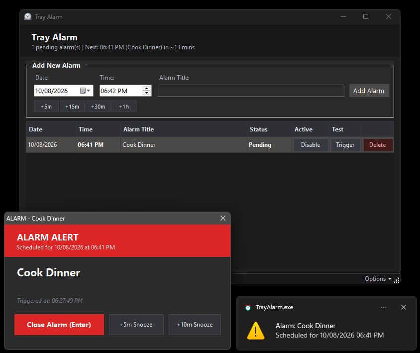

# Tray Alarm

A lightweight, portable Windows system tray application for managing customizable alarms with names/titles, times, and dates.



## Key Features

- **System Tray Resident:** Sits quietly in the Windows notification area / system tray. Closing the window minimizes it to the tray so alarms never get accidentally killed.
- **Customizable Alarms with Title & Time:** Schedule alarms such as `08:32 check stove` or `08:49 change tv to channel 5`.
- **Date Support with Today as Default:** Pick any date, with today pre-selected by default.
- **Top-Most Alarm Alert Pop-Up:** When an alarm time is reached, an alert window immediately pops up on top of all windows with an audible chime, showing the alarm details and buttons to **Close / Dismiss** or **Snooze (+5m, +10m)**. Pressing **Enter** or **Esc** also dismisses the alarm instantly.
- **Portable & Zero-Dependency:** Compiles to a single standalone `TrayAlarm.exe` (~36 KB) requiring no installers, Node.js, or Python. Runs out-of-the-box on Windows 10 and Windows 11.
- **Hand-Editable `alarms.csv`:** Stores all alarms in `alarms.csv` in the same directory. You can edit this file in Notepad or Excel while the app is running; the app automatically detects file changes and reloads immediately!
- **System Theme Colors & Dark Mode Support:** Automatically detects and applies Windows system colors and light/dark mode. Integrates with modern Windows 11 UI elements for a native feel. You can also manually switch between *System Default*, *Light Mode*, and *Dark Mode* from the Options menu or tray icon.
- **Quick Preset Buttons:** Quick `+5m`, `+15m`, `+30m`, and `+1h` shortcut buttons to set alarms rapidly.

---

## Quick Start

1. Double-click **`TrayAlarm.exe`** to launch the application.
2. The manager window will appear, and an alarm clock icon will be visible in the system tray.
3. Close the window with `[X]` anytime—it stays running in your system tray. Double-click the tray icon to reopen the manager.
4. To exit completely, right-click the tray icon and select **Exit**.

---

## Setting Alarms via the GUI

1. **Date:** Defaults to today's date (`MM/dd/yyyy`). Click the dropdown to pick a future date if needed.
2. **Time:** Enter time in 12-hour format (`hh:mm AM/PM`), or click the preset buttons (`+5m`, `+15m`, `+30m`, `+1h`) to quickly offset from right now.
3. **Title:** Type your reminder (e.g., `check stove`, `change tv to channel 5`).
4. Click **`+ Add Alarm`** or press **Enter**.

---

## Modifying `alarms.csv` by Hand

The application saves alarms to `alarms.csv` in the same folder. You can open and edit it in Notepad at any time (or click **"Open alarms.csv"** in the app/tray menu).

### CSV Format

```csv
Date,Time,Title,Status
10/08/2026,08:32 AM,check stove,Pending
10/08/2026,08:49 PM,change tv to channel 5,Pending
```

### Tolerant Parser Rules

The parser supports multiple convenient formats:

- **Minimal (Time & Title only):**
  ```csv
  8:32, check stove
  8:49, change tv to channel 5
  ```
  *(Date will automatically default to today, and status will default to `Pending`)*

- **Date, Time, Title:**
  ```csv
  2026-10-07, 08:32, check stove
  ```

- **Titles with commas (use quotes):**
  ```csv
  2026-10-07, 14:00, "team sync, room 402", Pending
  ```

- **12-Hour AM/PM formats:**
  ```csv
  8:32 AM, check stove
  8:49 PM, change tv to channel 5
  ```

- **Special dates:** You can write `today` or `tomorrow` in the Date column.

When you save `alarms.csv`, the app instantly detects the file change and reloads the alarms in real time!

---

## Rebuilding from Source

If you want to modify the C# source code in `src/`, rebuild with one command:

```cmd
build.bat
```

or via PowerShell:

```powershell
.\build.ps1
```

The script uses Windows' built-in C# compiler (`csc.exe`) targeting .NET Framework 4.8. No additional SDK installation is required.

---

## Running Automated Tests

To run the unit and parsing tests:

```powershell
& "C:\Windows\Microsoft.NET\Framework64\v4.0.30319\csc.exe" /nologo /target:exe /out:tests\TestRunner.exe /r:System.dll,System.Core.dll,System.Drawing.dll,System.Windows.Forms.dll,System.Data.dll src\AlarmItem.cs src\CsvRepository.cs src\ThemeManager.cs tests\TestRunner.cs
.\tests\TestRunner.exe
Remove-Item tests\TestRunner.exe
```
